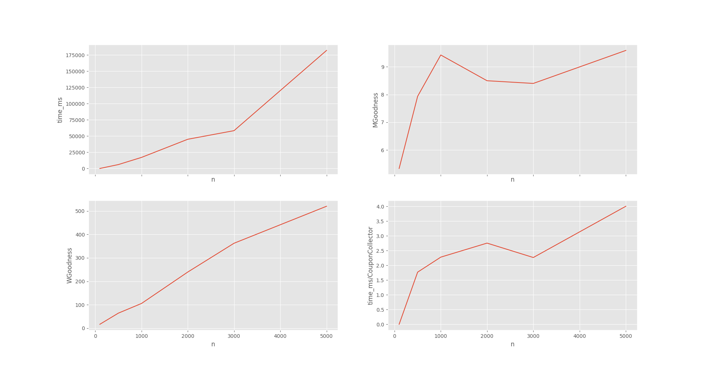

# Question 4

# Question 5
n   time_micros  MGoodness  WGoodness  time_ms/CouponCollector
100        0.00   5.340000    16.8400                 0.000000
500     6000.25   7.936000    64.3340                 1.768783
1000   17031.25   9.421000   105.5240                 2.277589
2000   44999.00   8.495500   239.4845                 2.753613
3000   58276.50   8.398667   362.2550                 2.265003
5000  181921.75   9.585400   519.9838                 4.003915
8000   270089.5   7.641625  1026.2355                 3.532541
15000 - MemoryError

We define “goodness” of a match as the position in the preference list. We will number positions from one (not zero as is standard for array indexing.) Note that lower numbers are good. To be precise, suppose m is matched with w.The mRank of m (written mRank(m)) is the position of w in m’s preference list, and the wRank of w is the position of m in w’s preference list. We define the MRank of a matching to be the sum of all of the mRank(m) and the WRank of w to be the sum of all of the wRank(w). If there are nM’s (and nW’s), we define the MGoodness to be MRank/n and the WGoodness to be WRank/n.

Q. As the size of the problem increases - how does the goodness change for M and W?

WGoodness is O(n)
MGoodness is O(logn)

Run time is not polynomial but seems slightly higher than O(nlogn)

Q. How do your results relate to result from the coupon collector problem? 
I would suggest looking at the slides for lecture 5 (or rewatching the lecture). Richard talked about it in class a little bit.
Coupon collector complexity is nlogn+0.57n . Run time seems be a constant multiple of coupon collector complexity. But, for higher n, the constant values are slightly high.

for n = 15000 I got memory error since my laptop ran out of memory as it requires )(n^2) memory.

## Question 6
             time_s  MGoodness      WGoodness
1000    0.015626    6.11800    836.72500
10000   0.347475    7.68000   8674.94450
100000  6.250381   10.35613  90388.15315
1000000  267.126089  14.845793  932650.559885

            time_s  MGoodness    WGoodness
    1000     0.043646   7.026200    861.77640
    10000    0.602480  11.491620   9087.75528
    100000  14.337444  11.838222  91496.48217
    1000000 380.481416  13.926717  928043.49204

Write a summary of your results for large n, including both the statistics for rank/goodness, as well as recorded run-time of the program. 

What does the estimated growth rate in runtime?

You should average over several runs for each value of n, (but there is no need to run a large number of times.) You should run your program with values of n up to at least 1,000,000.

